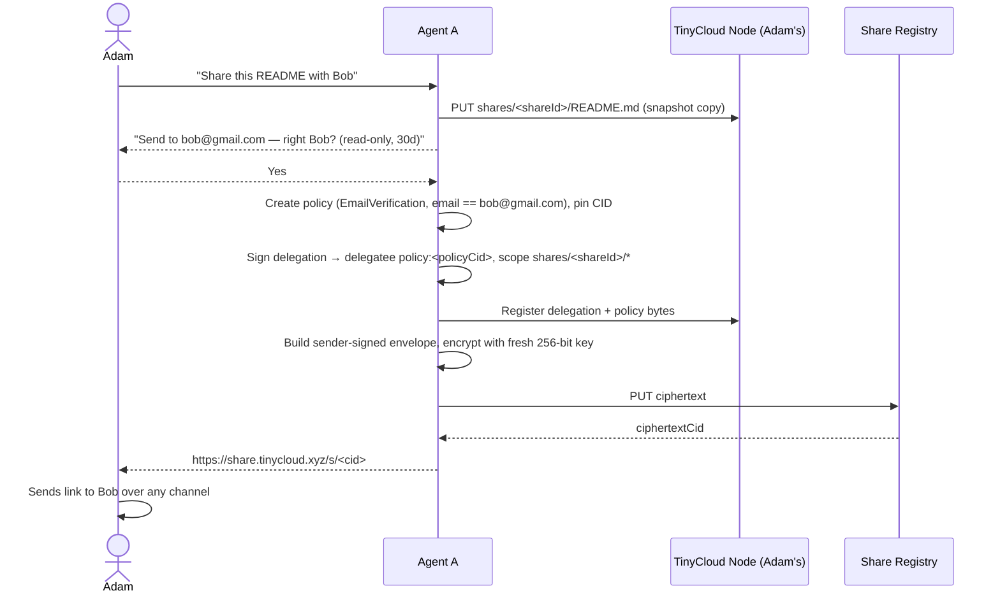
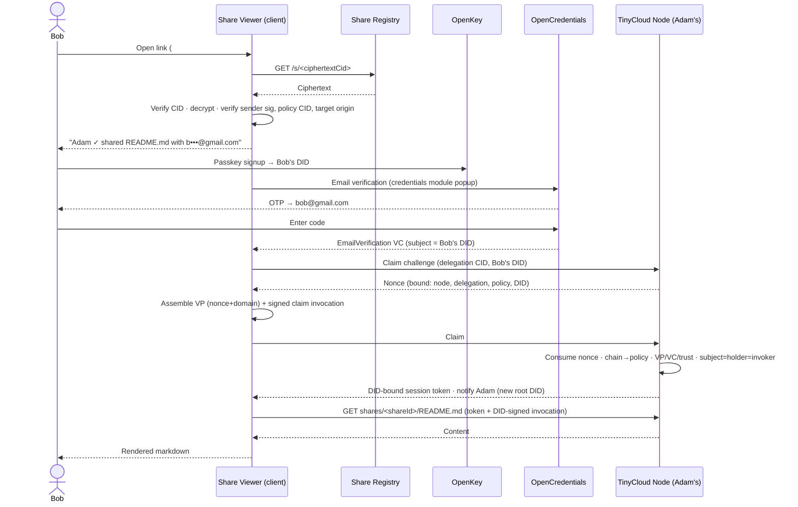
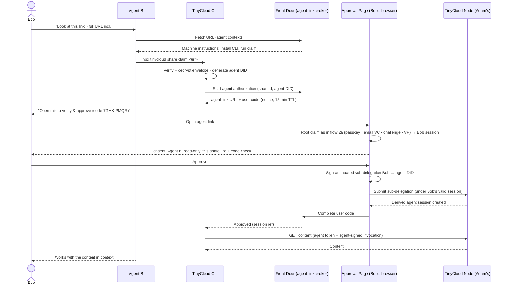
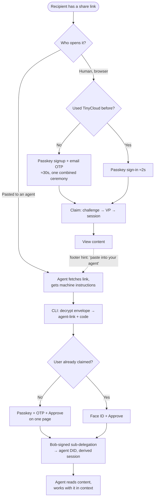

# TinyCloud Sharing — UX Blueprint

> Status: draft v2 · 2026-07-10 — mechanism revised after a Claude × Codex design dialogue (see §12 design record).
> Scope: user-experience blueprint for email-addressed sharing — sender-agent flow, human-recipient flow, agent-recipient flow. Wireframes and sequence diagrams; protocol details only where they shape the UX.
> Companions: `sharing-viewer-and-registry.md` (share.tinycloud.xyz viewer product + registry service, dialogue round 3) · `../wireframes/` (SVG wireframes of every flow).

## 1. Cast & systems

| Actor | Description |
|---|---|
| **Adam** (User A) | Existing TinyCloud user. Wants to send a document to Bob. |
| **Agent A** | Adam's coding/assistant agent, already authorized against Adam's space. |
| **Bob** (User B) | Recipient, `bob@gmail.com`. Has never used TinyCloud. |
| **Agent B** | Bob's agent (flow 2b only). Has no TinyCloud tooling installed at start. |

Systems involved:

- **TinyCloud node** — storage + capability verification + **policy engine** (evaluates delegations that terminate at a policy CID against a Verifiable Presentation, per the TinyCloud policy engine spec (internal; see protocol.tinycloud.xyz for the public protocol docs)).
- **Share registry / front door** — content-addressed store of *encrypted* share envelopes: put a blob, get back a CID-addressed short URL. Serves the landing page (human HTML + machine-readable agent instructions). It never sees plaintext, policies, or VPs — it cannot list, evaluate, issue, or revoke anything.
- **OpenKey** — passkey signup/sign-in; gives Bob a key (DID) in seconds.
- **OpenCredentials + SDK credentials module** — the popup flow that binds an email to a key by OTP and issues an `EmailVerification` credential whose subject is the user's DID.
- **TinyCloud CLI** — the agent-facing surface for claiming and reading shares.

## 2. The crux: the link is a combo — possession AND proof

Today's share link (`tc1:<base64>` from `SharingService`) embeds an ephemeral **private key** plus a UCAN — a pure bearer credential in the URL itself. Anyone holding the URL is Bob. The v2 design keeps its best property — *the delegation travels with the link and the recipient self-serves, no server-side ceremony, no sender online* — and, **for addressed shares (the default), replaces the embedded key with a policy proof requirement**. ("Anyone with the link" bearer shares remain a per-share option with different — and honestly weaker — security semantics; see the target spectrum in §2.1.):

> Agent A signs a delegation whose delegatee is a **pinned policy CID**: "anyone who can present an `EmailVerification` credential for `bob@gmail.com` may invoke `tinycloud.kv/get` on `shares/<id>/*`." The recipient brings their **own** key (OpenKey passkey), obtains the email credential, and self-assembles the authorizing material: a UCAN invocation from their own DID + a VP satisfying the policy, with the chain terminating at the policy CID.

Possession of the link is **necessary but not sufficient** — you must also satisfy the policy. Comparison:

| Model | Link theft | Sender offline OK | Recipient identity | Verdict |
|---|---|---|---|---|
| **Bearer (today)** — private key in link | Total compromise | ✓ | None — holder is Bob | Fine for "anyone with the link"; wrong tool for "share with Bob" |
| Server escrow — service re-issues to Bob's DID | Safe | ✓ | ✓ | Collapses into policy-target anyway: either the escrow holds sub-delegation power from Adam (service compromise = authorization compromise), or the node verifies a conditional delegation — which *is* the policy primitive |
| **Policy-target delegation (v2)** | Attacker learns invitation metadata, gets no content | ✓ | ✓ cryptographic (VC subject = VP holder = invoker) | **Chosen.** One primitive serves 1:1 shares, org policies (`*@acme.com`), and future group shares |

### 2.1 Link anatomy & the share registry

Delegation + policy + metadata ≈ 1–2 KB — too big for a link and too revealing to publish. So the link points into a registry and carries a decryption key in the **fragment** (never sent to any server):

```
https://share.tinycloud.xyz/s/<ciphertextCid>#k=<base64url 32-byte key>
```

- The registry stores an **encrypted envelope** (AES-256-GCM, fresh random key per share, versioned protocol label). It is addressed by the **CID of the ciphertext** — immutable; the registry cannot swap bytes under a URL, and stale-cache is harmless because identical-by-construction. **The envelope lives on IPFS** — a single-uploader node we operate (real deletion at expiry, no DHT announcement; companion spec §6) — so `/s/<cid>` *is* an IPFS CID (`bafkr…`), fetchable and client-verifiable through any trustless gateway we choose to expose.
- Inside the ciphertext is a **sender-signed envelope**: `{version, shareId, delegation (full signed chain), authorizationTarget, target {origin, nodeAudience, spaceId, resource {kind: exact|prefix, path}}, display {senderName, filename, recipientHint}, expiry, signature}`. `authorizationTarget` is a **signed discriminated union** — `{kind:"policy", policyCid, policyBytes}` | `{kind:"bearerKey", sessionJwk}` | `{kind:"recipientDid", did}` — so non-policy envelopes carry no vestigial policy fields, and the target kind itself is covered by the sender signature (an attacker can't re-frame a policy share as a bearer one). The signature covers every field — including `target.origin`, which closes the "tampered host exfiltrates your VP" hole in today's format.
- The recipient's client verifies ciphertext CID → decrypts with `#k` → verifies the sender signature, policy CID, and canonical target origin **before sending anything anywhere**.
- Privacy stance: the exact recipient email is cleartext *inside* the encrypted envelope — visible only to link holders, who by definition were handed it by Adam (they already knew he was sharing with Bob). Hashed email matchers were considered and rejected: emails are low-entropy, so any link holder could dictionary-test the hash anyway; it only adds canonicalization pain. The registry and any CDN in front of it learn nothing.
- **Deleting the registry object is never revocation.** Revocation happens at the enforcing node against the delegation CID. Replacing an envelope (rotation) must explicitly revoke the superseded delegation.
- Growth path: CDN/R2 edge caching in front of our node for availability; Storacha/Filecoin only as an opt-in "durable link" (their permanence is a liability for expiring shares — companion spec §6.1).

**The delegation-target spectrum — one link shape for every kind of share.** The envelope always carries the big delegation object; *what kind of principal the delegation targets* is a per-share choice, and the same `/s/<cid>#k=` link serves all of them:

| Target | Envelope carries | Who can open | Use |
|---|---|---|---|
| **Policy CID** (`policy:<cid>`) | Delegation + canonical policy bytes | Anyone who can prove the policy's credential requirement (this blueprint's Bob flow) | Email-addressed 1:1, org (`*@acme.com`), future groups |
| **Embedded key** | Delegation to a fresh session DID + that session's private JWK | Anyone holding the link — bearer semantics, like today's `tc1:` links but the key rides *inside the encrypted envelope*, not the URL, so links stay short and the registry still sees nothing | "Anyone with the link" shares |
| **Recipient DID** | Delegation to a known DID | Exactly that keyholder — no claim ceremony, just sign-in | Re-shares, device-to-device, agent-to-known-agent |

The fragment `#k` always carries only the AEAD key; whatever additionally unlocks *content* — the policy proof requirement, the embedded session key, or nothing beyond your own key — sits inside the ciphertext.

**Be honest about what each target means for link theft.** For policy and recipient-DID shares, a stolen link yields invitation metadata only — content still requires the credential or the named key. For a **bearer share, the complete link *is* content authority**: whoever holds `/s/<cid>#k` can decrypt the session key and read the content. What improved vs today's `tc1:` links: the private key is no longer serialized into the visible URL string (it's inside a CID-verified, sender-authenticated ciphertext), registries/logs/link-scanners that see the URL-without-fragment learn nothing, the envelope gains versioning + a signed target origin, and the share is operationally deletable. What did **not** improve: link theft = full delegated authority. That's the honest price of "anyone with the link," and the sender UI must say so when that target is chosen (and default to the policy target).

**Per-target semantics** (the claim protocol in §2.2 is the *policy* path; the others are simpler):

| Target | Opening path | Renewal | Notification & revocation |
|---|---|---|---|
| Policy CID | Passkey → credential → challenge → claim → session (§2.2) | Session renewal re-evaluates the VC/status | New-root-DID notifications; per-DID and whole-share revocation |
| Embedded key | Decrypt JWK → direct-key invocation (no ceremony) | No credential to re-evaluate; extending means a new envelope | Holders are indistinguishable (one shared DID) — no per-holder anything; revoke the delegation CID, killing the whole link |
| Recipient DID | Sign in with the named key → direct-key invocation | Sender re-delegates (no claim to renew) | Notify on first use; revoke delegation or session |

### 2.2 The claim protocol — policy-target shares (what the recipient's client constructs)

1. **Resolve**: fetch ciphertext, verify CID, decrypt with fragment key, verify sender signature + policy CID + target origin.
2. **Identity**: create/select DID (OpenKey passkey); obtain `EmailVerification` VC with `credentialSubject.id` = that DID (OpenCredentials OTP).
3. **Challenge**: ask the *signed* target origin for a claim nonce, bound to {node audience, delegation CID, policy CID, claimant DID}. Nonce-based, single-use, short-lived — never timestamp-only.
4. **Assemble**: VP whose holder proof covers nonce + domain; signed claim invocation referencing the exact delegation CID and covering capability subset, node audience, nonce, request digest, VP digest.
5. **Verify (node)**: consume nonce atomically; validate chain → terminal policy CID; recompute policy from canonical bytes; verify VP/VC, trust store, credential status; enforce `VC.credentialSubject.id == VP.holder == invocation issuer` (holder equality alone is insufficient — an attacker could wrap someone else's VC in a self-named VP); intersect caveats; check deny policies and revocation.
6. **Session**: node records a short-lived, DID-bound session and returns an opaque token. **Token alone never authorizes** — every subsequent invoke is token + fresh DID-signed invocation (audience, body digest, short expiry, unique `jti`). No VP re-verification per read; re-evaluate on renewal.
7. **Sub-delegate**: while a root session is valid, Bob can submit a Bob-signed, attenuated sub-delegation to an agent DID → derived, shorter-lived agent session linked to Bob's claim.

### 2.3 Multi-claim is a feature (policy-target shares)

These guardrails are meaningful only where distinct claimants exist: policy shares. Bearer shares have one indistinguishable embedded DID (nothing per-holder to notify or revoke); recipient-DID shares have exactly one preselected root.

An exact-email policy means "any DID currently able to prove control of this mailbox" — not "the first DID to prove it." Bob claiming from his laptop, then his phone, then sub-delegating to his agent requires **no re-share**. Guardrails instead of single-claim:

- Notify Adam on the **first** successful claim by each new *root* DID (not on renewals; derived agent sessions are recorded under Bob's claim, not separately notified).
- Durable per-share claim history (root DIDs + derived sessions), visible to both sender and recipient.
- Short session TTLs, VC re-evaluation on renewal, per-DID and whole-share revocation, rate limits, and a sane active-root-DID ceiling.

## 3. Design principle: automatic / easy / manual

Every step in every flow is classified:

- **Automatic** — no human involvement; agents and services do it.
- **Easy** — one tap / one paste / one OTP; no reading, no choices.
- **Manual** — the human must think or decide. Budget: **at most one manual step per actor per flow**, and it should always be an *identity or consent* decision, never a plumbing task.

The manual steps we deliberately keep:

1. Adam confirms the recipient email ("is bob@gmail.com the right Bob?") — consent + correctness.
2. Bob proves his email (OTP) — identity.
3. Bob approves his agent's access (flow 2b) — consent.

Everything else — policy creation, delegation signing, envelope encryption, registry upload, CLI install, challenge/claim assembly, session refresh — must be automatic. No human ever sees the words DID, delegation, policy, or VP; those live in the audit log for whoever wants to verify.

---

## 4. Flow 1 — Adam shares (sender side)

Adam already has a space. His agent handles everything except two moments: confirming the recipient and sending the link. (First-time sender with no TinyCloud yet: the agent routes him through the signup site first — §13, wireframe 11.)

**Layout convention:** shares live under a canonical prefix in Adam's space — `shares/<shareId>/…` where `shareId` is unguessable (128-bit random). Each share is its own subtree; the delegation is scoped to exactly one share, so the blast radius of any mistake is one folder.

**Snapshot vs live:** default is **copy-on-share** (the agent copies the file into `shares/<shareId>/`). Adam keeps editing his original without leaking work-in-progress; a future "live share" can delegate into the real path instead. This is a UX decision, not an implementation detail — "what does Bob see if I keep editing?" must have one predictable answer.

### Chat wireframe — Agent A

```
┌─ Adam ⇄ Agent A ─────────────────────────────────────────────┐
│ Adam:  I wrote up the README — share it with Bob.            │
│                                                              │
│ Agent: I'll share README.md via TinyCloud.                   │
│        Recipient: bob@gmail.com  (from your contacts)        │
│        Access:    read-only · expires in 30 days             │
│                                                              │
│        Is that the right Bob?   [Yes, share]  [Change…]      │
│                                                              │
│ Adam:  yes                                                   │
│                                                              │
│ Agent: ✅ Shared. Send Bob this link:                        │
│        https://share.tinycloud.xyz/s/bafy…#k=…               │
│        Only someone who verifies bob@gmail.com can open it.  │
│        I'll tell you when Bob (or any new device) claims it. │
│        You can revoke it anytime ("revoke Bob's share").     │
└──────────────────────────────────────────────────────────────┘
```

Notes:
- The agent states scope + expiry *before* Adam confirms — one decision covers everything.
- The link is sent by **Adam over his own channel** (iMessage, email, whatever). TinyCloud never needs Bob's inbox for delivery — only for verification. The social context ("link from my friend Adam") stays where trust already exists.
- "I'll tell you when Bob claims it" is the multi-claim guardrail surfacing as a feature: presence, not paranoia.

### Sequence



**Effort ledger (Adam):** 1 easy step (confirm), 1 manual-ish step (paste link to Bob). Everything else automatic.

---

## 5. Flow 2a — Bob opens the link in a browser (first time ever)

The whole funnel is: **click → passkey → OTP → content.** Target under 60 seconds, three interactions. Everything in §2.2 happens silently inside the viewer client.

### Wireframe — landing page (signed out, first visit)

```
┌─ share.tinycloud.xyz/s/bafy…  (envelope decrypted locally) ──┐
│                                                              │
│   📄  README.md                                              │
│                                                              │
│   Adam Turing (adam@example.com ✓ verified) shared           │
│   a document with b•••@gmail.com                             │
│                                                              │
│   To open it, confirm you own that email address.            │
│                                                              │
│              [ Continue with bob@gmail.com ]                 │
│                                                              │
│   ─ How this works ─────────────────────────────────────     │
│   TinyCloud shares are end-to-end verifiable. You'll         │
│   create a passkey (Face ID / Touch ID — no password)        │
│   and confirm a code we email you. Takes ~30 seconds.        │
└──────────────────────────────────────────────────────────────┘
```

Key choices:
- **Sender shown verified.** Adam's identity comes from the *signed envelope* — the page renders it only after signature verification. Share links are a phishing-shaped object; trust must run both ways.
- The masked hint (`b•••@gmail.com`) comes from the envelope's `display.recipientHint`; the full address is in the (decrypted) policy — visible to link holders, never to the registry.
- File name + sender are visible pre-auth (they're invitation metadata Adam chose to send); **content never is**.
- The viewer is a minimal static client: strict CSP, no third-party scripts, `Referrer-Policy: no-referrer` — the fragment key and VP must never leak via analytics or referrers.

### Wireframe — one combined ceremony (OpenKey popup → credentials module)

```
┌─ OpenKey ────────────────────┐    ┌─ Confirm your email ─────────┐
│  Create your key             │    │  We emailed a code to        │
│                              │ →  │  bob@gmail.com               │
│   [ 🔑 Continue with         │    │                              │
│        passkey ]             │    │        [ 4 8 2 · 9 1 7 ]     │
│                              │    │                              │
│  One Face ID. No password.   │    │  ✓ Verified — opening doc…   │
└──────────────────────────────┘    └──────────────────────────────┘
```

The recipient experiences this as **one flow**, not "sign up for a product, then do a second thing." OpenKey signup and credential issuance are chained by the credentials module; Bob never sees a dashboard, a plan picker, or an empty home screen. The share content *is* the onboarding destination. Behind the OTP screen, the client runs the challenge → VP → claim steps and lands in a session.

### Wireframe — viewer

```
┌─ share.tinycloud.xyz/s/bafy… ────────────────────────────────┐
│  📄 README.md · shared by Adam Turing ✓ · read-only          │
│  ────────────────────────────────────────────────────────    │
│  # Project Phoenix                                           │
│  Phoenix is a small tool that…                               │
│                                                              │
│  ⋮ (rendered markdown)                                       │
│  ────────────────────────────────────────────────────────    │
│  [ Download ]      Expires Aug 9 · You're bob@gmail.com      │
│                                                              │
│  ┌──────────────────────────────────────────────────┐        │
│  │ 💡 Want your agent to work with this doc?        │        │
│  │    Paste the link into your agent — it'll know   │        │
│  │    what to do.                                   │        │
│  └──────────────────────────────────────────────────┘        │
└──────────────────────────────────────────────────────────────┘
```

That footer hint is the bridge from flow 2a to flow 2b — recipients discover the agent path without being taught.

### Sequence



### Return visits — and second devices

Bob clicks the same link later → passkey prompt (one Face ID, ~2 s) → fresh challenge → session → content. His email credential is durable; no OTP again. Opening the link on his **phone** just repeats the claim with a new DID — no re-share, Adam gets one "Bob's new device" notification.

**Effort ledger (Bob, first time):** 3 easy steps — tap continue, one Face ID, one OTP. Zero manual decisions. Return visit: 1 easy step.

**Wrong-Bob dead end (must design, not improvise):** two distinct failures. (1) Adam typo'd an *unused* address → whoever opens it can't pass the OTP → page says "this share is addressed to someone else — ask Adam to re-share," with one-tap notify-Adam. (2) Adam typo'd a *real person's* address → that person can legitimately claim. Only Adam's confirmation step (flow 1) and the claim notification catch this. Never silently 403.

---

## 6. Flow 2b — Bob hands the link to his agent

Bob pastes the link into Agent B: *"look at this and do stuff with it."* The pattern is the **OAuth device-authorization grant, reshaped for delegations**: the agent starts a claim, surfaces a short agent-link for the human, and the human's one browser session does signup + email proof + consent — producing a **Bob-signed, attenuated sub-delegation to the agent's DID** and a derived session. The node never signs on Adam's behalf; it caches verified authorization.

### Agent discovery — the link must be dual-audience

The same URL serves:
- **Humans:** the landing page from flow 2a.
- **Agents:** machine-readable instructions (content negotiation / `.well-known/tinycloud-share` / an `llms.txt`-style block in the HTML): what this is, how to install the CLI (`npx @tinycloud/cli`), and the one command to run. The instructions are generic boilerplate from the front door — everything share-specific is inside the encrypted envelope, which only the link-holding agent (it has `#k`) can read.

This is the whole "installation onboarding" for agents: the link teaches the agent. No docs-hunting.

### Terminal wireframe — what Agent B does

```
$ npx @tinycloud/cli share claim "https://share.tinycloud.xyz/s/bafy…#k=…"

  ✓ Envelope verified — README.md, from Adam Turing (adam@example.com ✓)
  Addressed to: b•••@gmail.com

  This agent needs the recipient to verify their identity
  and approve access.

  → Ask the user to open:  https://share.tinycloud.xyz/a/7GHK-PMQR
    (code: 7GHK-PMQR · expires in 15 min)

  Waiting for approval… ⠋
```

Agent B relays to Bob in chat:

```
┌─ Bob ⇄ Agent B ──────────────────────────────────────────────┐
│ Bob:   look at this doc adam sent me and pull out the        │
│        action items → https://share.tinycloud.xyz/s/bafy…#k= │
│                                                              │
│ Agent: That's a TinyCloud share from Adam Turing addressed   │
│        to your email. I need you to verify it's you and      │
│        approve my access (read-only, this document only):    │
│                                                              │
│        👉 https://share.tinycloud.xyz/a/7GHK-PMQR            │
│                                                              │
│ Agent: ✅ Approved. Reading the doc now…                     │
│        Here are the action items: …                          │
└──────────────────────────────────────────────────────────────┘
```

### Wireframe — the agent-link approval page (Bob's browser)

```
┌─ share.tinycloud.xyz/a/7GHK-PMQR ────────────────────────────┐
│  Step 1 ✓ passkey   Step 2 ✓ email   Step 3 → approve        │
│                                                              │
│   🤖  "Agent B" on Bob's-MacBook wants to access:            │
│                                                              │
│        📄 README.md  (shared by Adam Turing ✓)               │
│        Access: read-only · this document only                │
│        Duration: 7 days (renewable)                          │
│                                                              │
│        Code shown by your agent:  7GHK-PMQR  ✓ matches       │
│                                                              │
│           [ Approve access ]      [ Deny ]                   │
└──────────────────────────────────────────────────────────────┘
```

If Bob is brand-new, steps 1–2 run first in the same page — the identical ceremony from flow 2a — then the consent screen. If Bob already claimed, he lands directly on step 3: **one Face ID + one Approve tap.** The code match is the anti-phishing binding (same reason OAuth device flow shows one): Bob confirms *this* browser session authorizes *that* agent.

### Sequence



The resulting chain — **Adam → policy(`bob@gmail.com`) ⇢ Bob (credential proof) → Agent B (Bob-signed sub-delegation)** — every hop either cryptographically signed or credential-proven, scoped, and expiring — is the product story: auditable agent-to-agent sharing where humans only ever made identity/consent decisions.

**Effort ledger (Bob, agent flow, already claimed):** 2 easy steps (open link + Face ID, tap Approve). First-timer: 4 easy steps. Agent B: fully automatic.

---

## 7. Recipient decision map



## 8. Automatic / easy / manual matrix

| Step | Adam | Agent A | Bob | Agent B | Class |
|---|---|---|---|---|---|
| Snapshot content into `shares/<shareId>/` | | ● | | | Automatic |
| Create + pin policy, sign delegation to policy CID, register with node | | ● | | | Automatic |
| Confirm recipient + scope | ● | | | | **Easy (1 tap)** |
| Sign envelope, encrypt, upload to registry | | ● | | | Automatic |
| Deliver link to Bob | ● | | | | Manual (his channel, his words) |
| Resolve link: fetch, verify CID, decrypt, verify signature | | | | | Automatic (client) |
| Passkey creation | | | ● | | Easy (1 Face ID) |
| Email OTP → credential | | | ● | | Easy (1 code) |
| Challenge → VP → claim → session | | | | | Automatic (client + node) |
| View content / return visits | | | ● | | Easy (1 Face ID on return) |
| Discover + install CLI | | | | ● | Automatic |
| Start claim, surface agent link | | | | ● | Automatic |
| Approve agent access (code check) | | | ● | | **Easy (1 tap)** |
| Sign + submit sub-delegation to agent | | | | | Automatic (client, from Bob's approval) |
| Fetch + use content | | | | ● | Automatic |
| Claim notifications, revoke, expiry | ● (ask agent) | ● | | | Easy |

## 9. Funnel risks & mitigations

1. **OTP latency/spam-folder** — the biggest drop-off in flow 2a. Mitigate: magic-link *and* code in the same email; "resend" after 20 s; the witness email paste-back pattern as fallback for agent-driven contexts.
2. **Passkey hesitancy** — users stall at Face ID prompts from unknown sites. Mitigate: the landing page sets expectations *before* the popup; verified-sender header builds trust first.
3. **Wrong recipient email** — two failure modes with distinct handling (§5). Silent failure poisons trust in the whole feature.
4. **Phishing shape** — attackers will clone the landing page. Mitigations: sender identity rendered only from verified signatures; passkeys are phishing-resistant by construction (nothing to type); agent-link code matching; one canonical share domain; minimal static viewer with strict CSP and no third-party scripts.
5. **Links carry the fragment key** — chat systems store the full URL. For policy and recipient-DID shares the link is a bearer credential for *invitation metadata only*; for **bearer shares it is content authority** (§2.1) — the sender UI must say so at creation, and the default target is policy. In every mode the viewer must never let `#k` reach a server, and docs must not oversell link secrecy.
6. **Expiry surprise** — there is no single "expires": at least five clocks run per share — `delegationExpiresAt` (root grant), `envelopeDeleteAfter` (registry retention), `sessionExpiresAt` (per claimed DID), VC expiry/status, and `agentGrantExpiresAt` (derived sub-delegations). They must be **separate signed timestamps**, never collapsed into one label, because their failure states differ: envelope-gone-but-delegation-valid ("ask sender to re-send the link" — access itself is fine), delegation-expired-but-envelope-live ("share ended — request renewal"), session-expired ("one Face ID to continue"), delegation-revoked-but-envelope-live ("access withdrawn"). Renewal one-taps only the session clock (fresh challenge + VC re-evaluation); an expired *root delegation* needs the sender to re-delegate — the recipient's dead-end screen offers a notify-sender tap. The sender's agent is told when a recipient hits any dead end. (Lesson from the Listen `delegation_expired` incident: silent TTLs with no renewal path burn users.)
7. **Revocation must actually revoke** — enforced at the node against the delegation CID (whole share) or session (per DID). Known risk: TC-140 (`kv.delete` revoke silent no-op) must be fixed and verified end-to-end before a revoke button ships. Deleting the registry blob is *not* revocation, and must never be treated as such.
8. **Claim-notification fatigue** — notify only on first claim per root DID; rate-limit claims; cap active root DIDs per share.

## 10. Open design questions

1. **Registry operations** — who runs the front door; ciphertext retention/GC policy (expire blobs after envelope expiry?); abuse controls for a public put-blob endpoint.
2. **Protocol freeze for the policy-terminated chain** — six items must be normatively specified with test vectors before implementation: canonical policy bytes/CID (RFC 8785 JCS), the terminal-policy chain rule, exact delegation-CID referencing in invocations, invocation binding fields, a fixed `EmailVerification` claim-extraction profile (one authoritative email field; today's spec has three candidates), and VP freshness/nonce binding. This is new protocol behavior beyond both current specs.
3. **Policy/trust state replication** — policy-engine-v1 leaves multi-node consistency open; shares must fail closed when policy or trust-store state is unavailable.
4. **Cross-node session portability** — sessions are node-local in v1 (envelope pins the target origin). Fine until replicated spaces serve reads from multiple nodes.
5. **View-only lighter tier?** — a "preview without a key" mode (OTP only, no passkey)? Current stance: no — one identity model, keep the ceremony under 30 s instead of weakening it.
6. **Live shares** — delegating into Adam's real path (updates flow through) as an explicit v2 toggle: "share a snapshot" vs "share the living doc."
7. **Sender identity bootstrap** — the envelope displays Adam's verified email; if Adam has no email credential yet, does share-creation trigger *his* verification flow first?
8. **Multi-recipient & groups** — 1:1 here; group shares should be a different policy document (`email_in: [...]` or group credential per TC-122), same link/registry/claim machinery. That's the payoff of the policy primitive.
9. **Agent scope defaults** — 7-day renewable read-only for agent sub-delegations: right default? "Just this once" option?
10. **CLI trust bootstrap** — pinned package name + signed instruction manifest so a malicious page can't tell an agent to `npx` something hostile.
11. **Credential lifecycle** — `EmailVerification` proves mailbox control *at issuance*. VC expiry/status checking cadence (issuance TTL? status list? re-verify on session renewal?) drives how stale a compromised-mailbox claim can be.
12. **Bearer-mode posture** — is the embedded-key target intentionally full link-theft risk (§2.1)? What warning does the sender see, and is policy always the default? Do bearer opens create any node-side record at all (rate limiting needs *something*), given per-holder identity doesn't exist?
13. **Sender share-management surface** — screen 13 covers claim history + revoke, but there's no outgoing-shares list, copy-link-again, or expiry-extension UX; and revoke needs to distinguish session vs DID vs whole-delegation.
14. **Recipient "shares received" index** — promised by the claim-history design but unspecced; a synced central index is itself a metadata store (local-only? account-synced? intentionally absent?).
15. **Missing wireframes** — bearer landing (no passkey/OTP), wrong-Bob dead end, sender's target-type choice, recipient-DID wrong-account/switch, offline-sender-node state, and the expiry/revocation dead-end screens from §9.6.

## 11. What to prototype first

The delegation-target spectrum (§2.1) changes the sequencing: the **bearer target needs no policy engine, no credentials, no account site** — so the registry + envelope + viewer stack can be de-risked first, in parallel with policy-engine work. Four slices, in order:

1. **Bearer vertical slice** — direct-key delegation → discriminated envelope → kubo upload → viewer fetch/verify/decrypt/render. Validates the entire link/registry/envelope/viewer/CLI stack with zero dependency on the policy engine or OpenKey integration. (Also: it's today's `tc1:` semantics reborn with short links — immediately shippable value.)
2. **Recipient-DID slice** — adds OpenKey sign-in (and settles the RP-ID question).
3. **Policy slice** — the §2.2 claim protocol against a real node, with the §10.2 interop test vectors (wrong email, wrong VC subject, untrusted issuer, modified policy bytes, replayed nonce, wrong audience…). Full claim/session/credential machinery.
4. **Agent-link device flow** (flow 2b) — after at least one human-owned root path works.

Dependency graph: the envelope schema + shared crypto SDK underlie everything; slices 1–2 need only direct-key invocation (which the node already supports); the policy engine + trust store + OpenCredentials branch feeds slice 3 and can be built in parallel with slice 1; the account site (RP-ID, hosted-space provisioning) is needed for a complete first-time-sender *product* but must not block validating the core link stack against an existing account.

## 12. Design record — 2026-07-10 dialogue (Claude × Codex)

Decisions locked in this revision, with the reasoning trail:

| # | Decision | Why |
|---|---|---|
| 1 | **Policy-target delegation in/behind the link**, recipient self-assembles authorization | Keeps today's self-serve shape without bearer keys; escrow collapses into the same primitive with an extra trusted party |
| 2 | **Encrypted envelope in a CID-addressed registry, key in URL fragment** | Solves link size + metadata privacy; registry/CDN sees only ciphertext; immutable ciphertext CID defeats byte-swapping and makes stale caches harmless |
| 3 | **Cleartext email inside the envelope; no hashed matchers** | Emails are low-entropy — any link holder could dictionary-test a hash anyway; hashing adds canonicalization pain for cosmetic gain |
| 4 | **No synthetic signed policy→holder edge** — chain terminates at policy CID, VP travels as request parameter (per policy-engine-v1 decision #12); needs normative definition + test vectors | A policy CID can't sign; inventing a fake edge complicates UCAN semantics |
| 5 | **`VC.credentialSubject.id == VP.holder == invocation issuer`**, nonce bound to node/delegation/policy/DID | Holder equality alone lets an attacker wrap someone else's VC in a self-named VP |
| 6 | **Multi-claim with guardrails** (first-claim notifications, claim history, TTLs, rate limits, revocation) — not single-claim escrow | An email policy means "whoever controls this mailbox," and multi-device/agent reuse without re-sharing is the feature |
| 7 | **Claim-once → short-lived DID-bound session**; token + DID-signed invocation per request, token alone never sufficient | Avoids per-read VP verification without recreating a bearer credential; node caches verified authorization, never signs for Adam |
| 8 | **Sender-signed envelope covers `target.origin`**; client verifies before contacting anything | Closes the VP-exfiltration-via-tampered-host hole in today's `tc1:` format |
| 9 | **Registry deletion ≠ revocation; envelope rotation must explicitly revoke the old delegation CID** | Content-addressed stores can't express revocation; only the enforcing node can |
| 10 | **Pinned policy CIDs only in share delegations** (no mutable policy names) | Mutable names let share terms change under an already-issued link |
| 11 | **Envelope store is IPFS** — single-uploader kubo we operate (product owner call, 2026-07-11); R2/CDN as edge cache; Storacha only as opt-in durable links | CID-native store matches the protocol; self-run keeps real deletion at expiry, which public IPFS/Filecoin can't offer |
| 12 | **One link shape, three delegation targets** — policy CID / embedded session key / recipient DID, selected per share; fragment always carries only the AEAD key | Unifies today's bearer links with credential-gated and DID-direct shares; links stay short in every mode |
| 13 | **Envelope `authorizationTarget` is a signed discriminated union**; per-target security claims stated honestly (bearer link = content authority); **five expiry clocks kept as separate signed timestamps** (round-4 gap review) | The universal "possession AND proof" thesis was true only for the policy target; collapsing clocks into one "expires" label hides five distinct failure states |
| 14 | **Prototype order: bearer slice → recipient-DID → policy claim → agent device flow** (round-4) | Bearer target needs no policy engine/credentials/account site — de-risks registry+envelope+viewer first, in parallel with policy-engine work |

## 13. Signup & account creation (living section)

> This section accumulates everything unclear or ambiguous about signup — update it as decisions land. Context sources: protocol.tinycloud.xyz (OpenKey = passkey/TEE-backed provider that produces and custodies the owner key every capability chain roots in; SIWE sign-in; no explicit "sign up" page exists in the protocol docs today), account.tinycloud.xyz (the account app).

### The intended shape

- **First-time senders are directed to a static signup site: `account.tinycloud.xyz`.** The sharing flow doesn't inline account creation for senders the way it does for recipients — the agent (or the viewer's "share something yourself" footer) hands off to the account site and resumes the share afterwards (wireframe 11).
- Signup there means: **create the owner key via OpenKey passkey** (one Face ID; the root DID all delegations chain from), then **choose where your data lives**:
  - **TinyCloud-hosted** (default) — a space on our infrastructure, working immediately;
  - **Self-hosted / local** — run your own tinycloud-node and point the account at it.
- **Agent-created accounts are possible but second-class.** An agent can bootstrap an identity non-interactively via the TinyCloud CLI when its human has no account — but the principle is: **the human should own the account they use, not the agent holding it for them.** The agent path exists so sharing never hard-blocks; the product should mark agent-held roots and continuously nudge toward the human claiming a proper OpenKey-rooted account.
- Email verification (the credential) is not necessarily part of signup — it's pulled in lazily the first time something needs it (sending a share displays your verified identity to recipients; claiming one proves yours).

### Unresolved / ambiguous — update as answered

1. **What exactly is account.tinycloud.xyz relative to OpenKey?** The passkey ceremony itself, or a wrapper that embeds/redirects to OpenKey? Passkeys are domain-bound (rpID) — which domain owns the credential matters for every future sign-in surface, including the share viewer.
2. **Hosting choice timing & migration.** Is hosted-vs-local chosen at signup, or default-hosted with migration later? Can a space move hosted ↔ self-hosted after creation (data moves, but delegations/space IDs reference the node — do existing share links survive a migration)?
3. **Local hosting vs sharing availability.** A share served from a laptop node is only fetchable while that laptop is up. Does share-creation warn locally-hosted senders? Is the encrypted envelope registry (always us) enough for the *link* to resolve gracefully to "sender's node is offline"?
4. **Agent-bootstrap mechanics.** When the CLI creates an identity for an agent's human: is that a full owner key held in the agent's keystore (root authority held by software)? What are the limits (can it create spaces? send shares?)?
5. **The claim/upgrade path.** How does a human later take ownership of an agent-created account — re-root (new OpenKey key becomes root, agent re-delegated under it), or transfer? Does anything break (existing shares/delegations rooted in the agent key)?
6. **Is email verification ever required at signup itself**, or strictly lazy? (Wireframe 11 currently shows it at share time — consistent with lazy.)
7. **Plans/payment at signup** — free tier limits for shares (count, size, expiry ceiling)? When does the money conversation happen — never during a first share, ideally.
8. **Recipient→sender conversion.** Bob already has an OpenKey passkey + email credential from claiming a share. When Bob wants to *send*, account.tinycloud.xyz should recognize the existing key and only add what's missing (a space) — signup for him should be one tap, not a second registration. (Identity reuse — no second root for Bob — is **not** deferrable even if the conversion polish is.)
9. **Passkey loss & recovery.** The passkey custodies the root everything chains from. Recovery story? Multi-device: does a platform-synced passkey reproduce the same DID on a second device, and what happens when it doesn't?
10. **Cross-domain ceremony mechanics.** The exact WebAuthn/popup/redirect choreography across account.tinycloud.xyz ↔ OpenKey ↔ share.tinycloud.xyz (which domain is the RP, what's framed vs redirected), and the signup-resume protocol (how the agent knows setup finished).
11. **Agent-created identity ownership.** Until human takeover exists, an agent-created account is agent-*owned*, not human-owned — where does its key/recovery secret actually live? Recommendation on the table: agent-held roots cannot create durable shares in the MVP.
12. **Account deletion/export, and self-host origin registration** (how a self-hosted node's origin becomes a valid, CSP-allowlisted share target).
