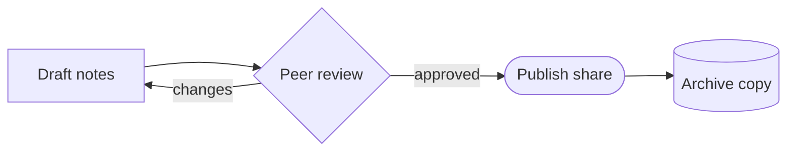

# Release flow (frontmatter)

The diagram turns HTML labels back on with frontmatter config; the viewer keeps SVG labels.

```mermaid
---
config:
  htmlLabels: true
  flowchart:
    htmlLabels: true
---
flowchart LR
  draft[Draft notes] --> review{Peer review}
  review -->|approved| publish([Publish share])
  review -->|changes| draft
  publish --> archive[(Archive copy)]
```
