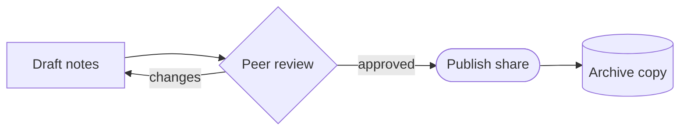

# Release flow (init directive)

The diagram turns HTML labels back on with an init directive; the viewer keeps SVG labels.

```mermaid
%%{init: {"htmlLabels": true, "flowchart": {"htmlLabels": true}}}%%
flowchart LR
  draft[Draft notes] --> review{Peer review}
  review -->|approved| publish([Publish share])
  review -->|changes| draft
  publish --> archive[(Archive copy)]
```
