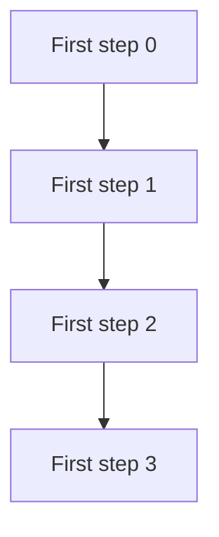
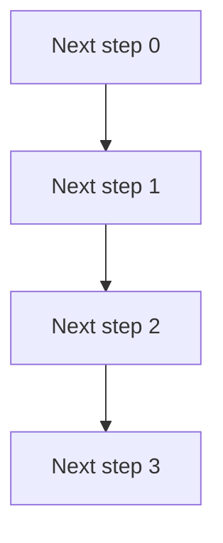

# Two diagrams

Two tall diagrams must both print every step.

```mermaid
flowchart TD
  a0[First step 0] --> a1[First step 1]
  a1[First step 1] --> a2[First step 2]
  a2[First step 2] --> a3[First step 3]
```

```mermaid
flowchart TD
  b0[Next step 0] --> b1[Next step 1]
  b1[Next step 1] --> b2[Next step 2]
  b2[Next step 2] --> b3[Next step 3]
```
