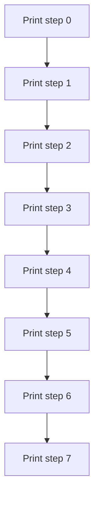

# Print check

A tall diagram must print every step.

```mermaid
flowchart TD
  s0[Print step 0] --> s1[Print step 1]
  s1[Print step 1] --> s2[Print step 2]
  s2[Print step 2] --> s3[Print step 3]
  s3[Print step 3] --> s4[Print step 4]
  s4[Print step 4] --> s5[Print step 5]
  s5[Print step 5] --> s6[Print step 6]
  s6[Print step 6] --> s7[Print step 7]
```
