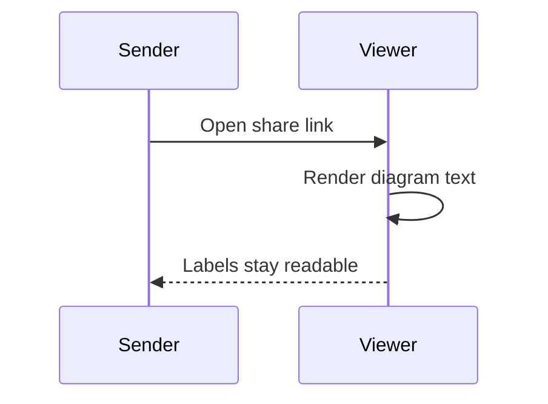
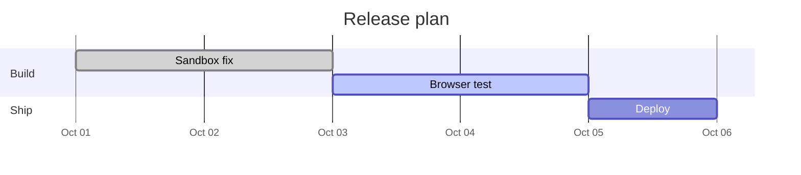

# Share handoff

Message labels and axis text sit on the diagram background, not inside filled shapes.

```mermaid
sequenceDiagram
  participant Sender
  participant Viewer
  Sender->>Viewer: Open share link
  Viewer->>Viewer: Render diagram text
  Viewer-->>Sender: Labels stay readable
```

```mermaid
gantt
  title Release plan
  dateFormat YYYY-MM-DD
  tickInterval 1day
  axisFormat %b %d
  section Build
  Sandbox fix  :done, fix, 2026-10-01, 2d
  Browser test :active, check, after fix, 2d
  section Ship
  Deploy       :deploy, after check, 1d
```
