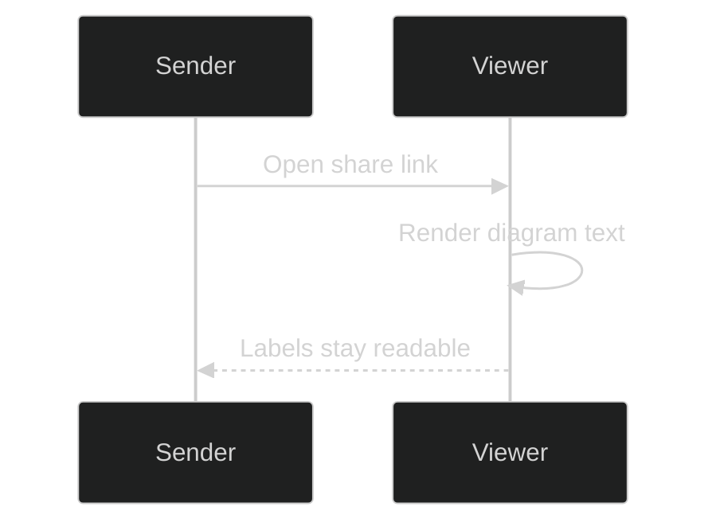
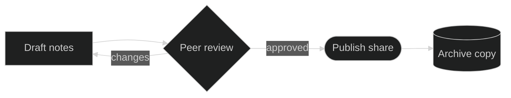

# Dark theme (init directive)

Both diagrams ask for the dark theme with an init directive; the viewer keeps the neutral theme its light card is made for.

```mermaid
%%{init: {"theme": "dark", "darkMode": true, "themeVariables": {"darkMode": true, "background": "#1e1e1e", "primaryColor": "#1f2937"}}}%%
sequenceDiagram
  participant Sender
  participant Viewer
  Sender->>Viewer: Open share link
  Viewer->>Viewer: Render diagram text
  Viewer-->>Sender: Labels stay readable
```

```mermaid
%%{init: {"theme": "dark", "darkMode": true, "themeVariables": {"darkMode": true, "background": "#1e1e1e", "primaryColor": "#1f2937"}}}%%
flowchart LR
  draft[Draft notes] --> review{Peer review}
  review -->|approved| publish([Publish share])
  review -->|changes| draft
  publish --> archive[(Archive copy)]
```
